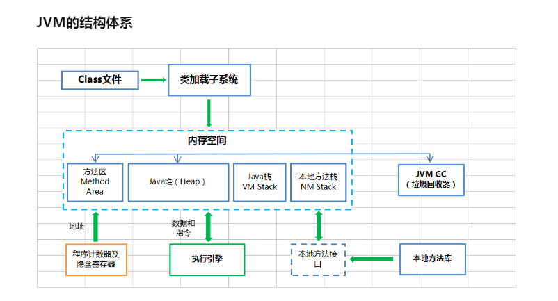

### 1.说一下jvm的主要组成部分？作用？
组成部分： 类加载器（ClassLoader） 运行时数据区（Runtime Data Area） 执行引擎（Execution Engine） 本地库接口（Native Interface） 
作用：首先通过类加载器会把java代码转成字节码，运行时数据区再把字节码加载到内存中，而字节码文件只是jvm的一套指令集规范，并不能直接交给底层操作系统去执行，因此需要特定的命令解析器执行引擎，将字节码翻译成底层系统指令，再交由cpu执行，而这个过程中需要调用其他语言的本地库接口来实现整个程序的功能。

### 2.说一下jvm运行时数据区？
程序计数器 虚拟机栈 本地方法栈 堆 方法区
### 3.说一下堆栈的区别？
栈内存存储的是局部变量而堆内存存储的是实体 
栈内存的更新速度快于堆内存，因为局部变量的生命周期很短 
栈内存存放的变量生命周期一旦结束就会被释放，而堆内存存放的实体会被垃圾回收机制不定时回收
### 4.队列和栈是什么？有什么区别？
队列和栈都是用来存储数据的 
队列允许先进先出检索元素，但也有例外的情况，Deque接口允许从两端检索元素 
栈和队列很相似，但它运行时对玄素进行后进先出检索。
### 5.什么是双亲委派模型?
### 6.类加载的执行过程？
5个步骤 加载：根据查找路径找到相应的class文件然后导入 
检查：检查加载的class文件的正确性 
准备：给类中的静态变量分配内存空间 
解析：虚拟机将常量池中的符号引用替换成直接引用的过程。 
初始化：对静态变量和静态代码块执行初始化工作。
### 7.怎么判断对象是否可以被回收?
**引用计数器**：为每个对象创建一个引用计数，有对象引用时计数器+1，引用被释放时计数器-1，当计数器为0时就可以被回收 
**可达性分析**：从GC Roots 开始往下搜索，搜索所走过的路径称为引用链。当一个对象到GC Roots没有任何引用链相连时，可回收 
### 8.java中都有哪些引用类型？
强引用，软引用，弱引用，虚引用
### 9.jvm都有哪些垃圾回收算法？
标记-清除，标记-整理，复制，分代
### 10.jvm有哪些垃圾回收器？
serial：最早的单线程串行垃圾回收器 
serial old 
parnew：是serial的多线程版本 
parallel：多线程，但parallel是吞吐量优先的收集器，可以牺牲等待时间换取系统的吞吐量 
parallel old 
cms：一种以获得最短停顿时间为目标的收集器，适合B/S系统 
G1：一种兼顾吞吐量和停顿时间的GC实现，是jdk9以后默认的GC选项
### 11.cms垃圾回收器？
concurrent Mark-Sweep,是以牺牲吞吐量为代价来获得最短回收停顿时间的垃圾回收器。对于要求服务器响应速度的应用上，这种垃圾回收器非常适合 
cms使用的是标记-清除算法，所以在gc的时候会产生大量的内存碎片，当剩余内存不能满足程序运行要求时，系统会出现Concurrent mode failure 
临时cms会采用serial old 回收器进行垃圾清除，此时的性能将会被降低。
### 12.新生代垃圾回收器和老垃圾回收器都有哪些？有什么区别？
新生代回收器：serial ，parnew，parallel Scavenge 
老年代回收器：serial old，parallel old，cms 
整堆回收器：G1 
新生代回收器一般采用的是复制算法，复制算法的优点是效率高，缺点是内存利用率低 
老年代回收器采用的是标记-整理法。
### 13.分代垃圾回收器是怎么工作的？
分代回收器有两个分区：老生代和新生代，新生代默认空间占比是1/3,老生代是2/3 
新生代有3个分区，eden,to survivor, from survivor ,它们的默认占比是8:1:1 
每次在From Survivor 到To Survivor 移动时都存活的对象，年龄就+1，当年龄到15时，升级为老生代。大对象会直接进入老生代。 
### 14.jvm调优的工具？
jdk自带了很多监控工具，都位于jdk的bin目录下，其中最常见的是jconsole和jvisualvm这两款视图监控工具 
jconsole：jdk自带的全能分析工具，可以分析：内存快照，线程快照，程序死锁，监控内存的变化，gc变化
### 15.常用的jvm调优参数有哪些？
-Xms2g:初始化堆大小2g; -Xmx2g:堆最大内存2g; -XX:NewRatio=4:设置新生代和老年代的内存比例为1:4 -XX:SurvivorRatio=8:设置新生代Eden和Survivor比例为8:2; -XX:+UseParNewGC:指定使用ParNew+Serial Old垃圾回收器组合; -XX:+UserParallelOldGC:指定使用ParNew+ParNew Old 垃圾回收器组合; +XX:+UseConcMarkSweepGC:指定使用CMS+Serial Old垃圾回收器组合; +XX:+PrintGC:开启打印gc信息; +XX:+PrintGCDetails:打印gc详细信息。
### 16. jvm？
Java Virtual Machine.java虚拟机。通过jvm，java在不同平台运行时不需要重新编译，只需要部署jvm就行。

