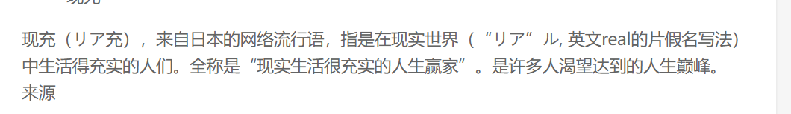

### 1.maven有哪些优点和缺点？
**优点**：简化了项目结构，易于上手 
便于项目升级，有助于多模块项目的开发 
有很多插件，便于功能扩展 
**缺点**：采用约定优于配置的策略，难于调试
### 2.maven坐标？
一般maven使用groupID,artifactID,version来表示一个项目的版本
### 3.maven常见的依赖范围有哪些？
compile，test，provided，runtime，system，import
### 4.maven的生命周期？
有三套生命周期： 
1. clean周期：用于清理上一次构建产生的文件，可以理解为删除target目录
2. 默认周期： 1.process-resources：处理reources下的文件，输出到classpath目录 2.compile：编译java文件，产生class 3.process-test-resources：处理test/resources目录下的文件，将其输出到测试的classpath目录中 4.test-compile：编译test/下的java文件 5.test：运行测试用例 6.package：打包，生成jar，war 7.install：部署到本地仓库 8.deploy：部署到远程仓库 
3. site周期
### 5.mvn clean package 进行项目打包，请问该命令执行了哪些动作来完成该任务？
调用了maven的clean周期和default周期的package，默认执行的任务有： 
1. maven-clean-plugin:clean 
2. resources->compile->testResources->testCompile->jar
### 6.依赖的解析机制？
1. 解析发布版本：如果本地有，直接用本地的，没有就向远程仓库请求。 
2. 解析快照版本：
3. 解析版本为latest，release
### 7.插件的解析机制？
### 8.多模块如何聚合？
配置一个pom的聚合模块，然后再该pom中用<module>声明要聚合的模块
### 9.对于一个多模块项目，如何管理项目依赖的版本？
先在父模块中声明dependencyManagement和pluginManagement,然后让子模块通过<parent>元素指定父模块，这样子模块在定义依赖就可以只定义groupID和artifactID,自动使用父模块的version，这样统一整个项目的依赖的版本。
### 10.常见的maven私服的仓库类型？
hosted repository(宿主仓库)，proxy repository(代理仓库),group repository(仓库组) 
**私服**，就是公司内部局域网的一台服务器，私服内部存储了本公司专用的jar，还充当了中央仓库的镜像，说白了就是一个代理。 
**中央仓库**，存储了互联网上的jar，由maven团队维护。
### 11. 既然maven进行了依赖管理，为什么还会出现依赖冲突？处理依赖冲突的手段？
对于maven来说，同一个groupId,artifactId下，只能使用一个version,如果两个模块要使用不同版本的依赖，就会产生冲突。
这里涉及两个概念：一个是**依赖传递**(如果A依赖B，B依赖C，那么引入A时，B，C都会被引入)，一个是**maven的最近依赖策略**(如果一个项目依赖了相同的groupId,artifactID,的多个版本，，那么在依赖树中离项目最近的那个版本会被使用) 
解决方法：
1. 使用<dependencyManager>,用于子模块的版本一致性
2. 使用<exclusions>在依赖传递中去掉不想要的依赖版本
3. 使用<dependency>显式依赖指定版本
