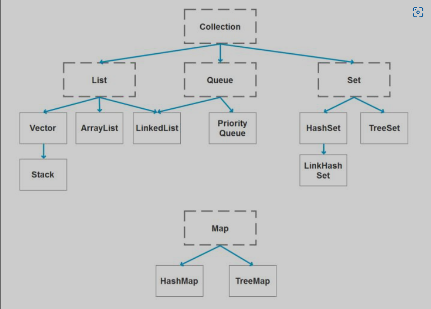
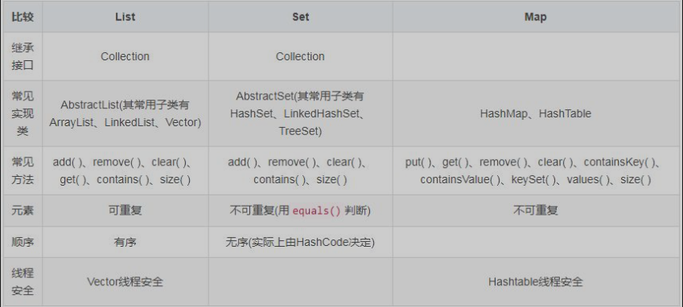

###1. java的容器都有哪些？

####Set下各种实现类对比：
**HashSet**基于哈希表实现 
1.不允许重复 
2.允许值为null，但是只能有一个 
3.无序 
4.没有索引，不包含索引操作的方法 
**LinkedHashSet**也是基于哈希表实现，但在hashSet的基础上多路一个链表，这个链表是用来维护容器中每个元素的顺序的。 
1.不允许重复 
2.允许值为null，但是只能有一个 
3.有序的 
4.没有索引，不包含索引操作的方法 
**TreeSet**是SortedSet接口的唯一实现类，是基于二叉树实现的。TreeSet可以确保元素处于排序状态。支持自然排序和定制排序，默认是自然排序。 
1.不允许重复 
2.不允许值为null 
3.没有索引，不包含索引操作的方法 
####List下各种实现类的对比
**ArrayList**是基于数组实现的，特定是查询快，增删慢 
查询快是因为数组的空间是连续的，查询时只有通过首地址和下标很快就能找到元素。 
增删慢是因为数组是不能扩容的，一旦增加或删除元素，内部操作就是开辟一个新的数组把元素copy到新数组，老的数组等待被垃圾回收。 
**LinkedList**是基于双向循环链表实现的，特定是查询慢，增删快 
查询慢：链表在内存中开辟的空间不一定是连续的，所以链表实现的方式是每个元素节点都会存放自己的地址，数据和下一个节点的地址，这样把所有的元素连接起来。 
**Vector**是基于数组实现的，相比于ArrayList它是线程安全的，如果不考虑安全，ArrayList性能更好。
####Map下各种实现类的对比
**HashMap**和**HashTable**都实现了map接口，主要区别有：线程安全，同步和速度 
1.HashMap是非synchornized,而HashTab是synchornized,这意味着Hashtab是线程安全的，多个线程可以共享一个Hashtable 
2.HashTable是同步的,Hashmap是非同步的，Hashtable在单线程环境下比hashmap慢 
3.无序的 
4.Hashmap可以接受null 
5.Hashmap去掉了HashTable的contains()方法，但加上了containsValue()和containsKey()方法。
**LinkedHashMap**和hashmap的区别在于多维护了一个链表，用来储存每一个元素的顺序。 
**TreeMap**比hashmap慢，树和哈希表的结构使然。 
###2.Collection 和 Collections 有什么区别？
java.util.Collection是一个集合接口，提供了对集合对象进行基本操作的通用接口方法。它的直接继承接口有List和Set 
Collections则是结合类的一个帮助类/工具类，提供了一系列静态方法，用于对集合中元素进行排序，搜索以及线程安全等各种操作。
###3.List,Set,Map之间的区别是什么？

###4.HashMap和Hashtable有什么区别？
###5.如何决定用HashMap还是TreeMap?
对于在Map中插入，删除和定位元素这类操作，HashMap是最好的选择。但如果要对一个有序的key集合进行遍历，TreeMap更好。
###6.HashMap的实现原理.
HashMap是基于哈希表的Map接口的非同步实现。此实现提供所有可选的映射操作，并接收null。此类不保证映射的顺序。 
HashMap的数据结构：在java中，最基本的结构就是两种，一是数组，二是模拟指针，所有的数据结构都可以用这两个基本结构来构造。HashMap实际上是一个链表散列的数据结构，即数组合链表的结合体。 
当往HashMap中put元素时，首先根据key的hashCode重新计算hash值，根据hash值得到这个元素在数组中的位置(下标),如果该数组在该位置上已经存放了其他元素，那么在这个位置上的元素将以链表的形式存放，新加入的放在链头，早的放在链尾，如果该数组中该位置没有元素，就直接将该元素放在该位置。
###7.HashSet的实现原理。
HashSet的底层由HashMap实现 
HashSet的值放在HashMap的key上 
HashMap的value统一为Present
###8.如何实现数组和list之间的转换？
list转数组：ArrayList.toArray() 
数组转list: Arrays.asList()
###9.ArrayList和Vector 的区别是什么？
Vector是同步的，而ArrayList不是。 
ArrayList比Vector快。 
ArrayList更加通用。
###10.Array和ArrayList有什么区别？
Array可以容纳基本类型和对象，而ArrayList只能容纳对象。 
Array是指定大小的，而ArrayList大小是固定的。 
Array没有ArrayList那么多功能，如addAll,removeAll和iterator.
###11.在Queue中，poll()和remove()有什么区别？
poll()和remove()都是从队列中取一共元素，但是poll()在获取元素失败的时候会返回空，remove()失败的时候会抛出异常。
###12.哪些集合类是线程安全的？
vector,statck,hashtable,enumeration
###13.迭代器Iterator是什么？
迭代器是一种设计模式，它是一个轻量级对象，可以遍历并选择序列中的对象。
###14.Iterator怎么用？有什么特点？
java中Iterator功能比较简单，而且只能单向移动： 
使用next()获取序列中的下一个元素 
使用hasNext()检查序列中是否还有元素 
使用remove()将迭代器返回的元素删除
###15.Iterator和ListIterator有什么不同？
Iterator可以遍历Set和List，但ListIterator只能遍历List 
Iterator对集合只能是前向遍历，ListIterator既可以前向也可以后向 
ListIterator实现了Iterator接口。

