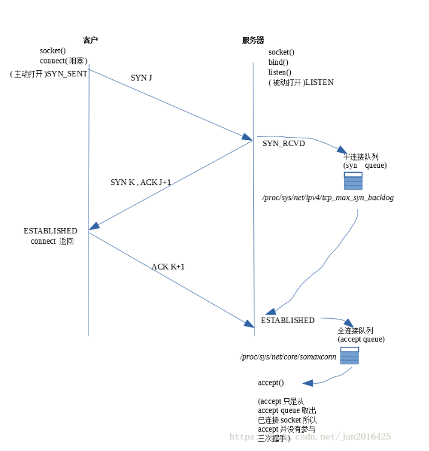

### 1.http响应码301和302代表什么？有什么区别？
代表url发生转移。 
301代表永久性转移，302代表暂时性转移
### 2.forward和redirect的区别？
代表了两种请求转发方式，直接转发和间接转发。 
直接转发Forward,客户端和浏览器只发出一次请求，间接转发实际上是两次http请求 
举个通俗的例子： 
直接转发就相当于：“A找B借钱，B说没有，B去找C借，借到借不到都会把消息传递给A”； 
间接转发就相当于："A找B借钱，B说没有，让A去找C借"。 
### 3.简述tcp和udp的区别？
tcp是面向连接，而udp是无连接的，即发送数据之前不需要建立连接 
tcp提供可靠的服务，通过tcp传输的数据无差错，不丢失，不重复且按需到达。udp不保证可靠交付。 
udp效率比tcp高。 
tcp是点到点的，udp支持一对一，一对多，多对一和多对多的交互通讯。 
tcp对系统资源要求更多。 
### 4.tcp为什么要三次握手？
为了实现可靠的数据传输，tcp协议的通讯双方，都必须维护一个序列号，三次握手的过程是通讯双方互相告知序列号起始值，并确认对方已经收到了序列号的必经步骤。

### 5.osi的七层模型？
应用层，表示层，会话层，传输层，网络层，数据链路层，物理层。
### 6.get和post有什么区别？
get在浏览器回退时是无害的，post会再次提交请求。 
get请求会被浏览器主动cache，post不会 
get请求智能进行url编码，post支持多种编码方式 
get请求参数会被完整保留在浏览器历史记录中，post不会 
get请求在url中传的参是有长度限制的，post没有 
get相比post不安全 
get参数通过url传递，post放在requestbody中 
